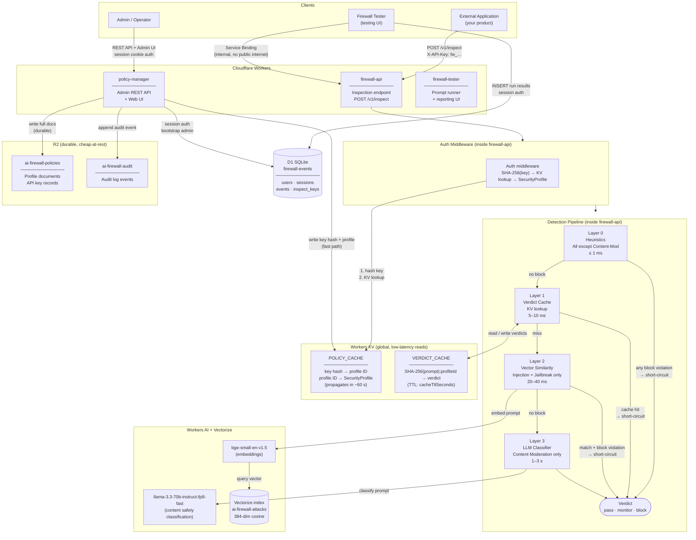

# Architecture — Cloudflare AI Firewall

## Component diagram



---

## Component roles

| Component | Type | Role |
|-----------|------|------|
| `firewall-api` | Worker | Latency-critical inspection endpoint. Runs the 4-layer detection pipeline for every prompt. Auth via `X-API-Key` header. |
| `policy-manager` | Worker | Admin control plane. Manages SecurityProfiles, API keys, audit log. Session cookie auth (admin role only). Writes to KV + R2. |
| `firewall-tester` | Worker | Developer tool. Runs prompt sets against `firewall-api` via Service Binding, stores results in D1, serves reporting UI. Session cookie auth (admin + tester roles). |
| `POLICY_CACHE` | KV | Shared between firewall-api and policy-manager. Stores SHA-256(key)→profileId pointer and full SecurityProfile documents. Globally replicated, ~60 s propagation. |
| `VERDICT_CACHE` | KV | Per-prompt verdict cache keyed by `SHA-256(prompt):profileId`. Short-circuits layers 2 and 3 on cache hit. |
| `ai-firewall-policies` | R2 | Durable storage for profile documents and API key records. Written by policy-manager; never read on the hot path. |
| `ai-firewall-audit` | R2 | Append-only audit log for all admin actions. |
| `firewall-events` | D1 | SQLite database shared by firewall-tester and policy-manager. Tables: `users`, `sessions`, `events`, `inspect_keys`. |
| `bge-small-en-v1.5` | Workers AI | Embeds the incoming prompt into a 384-dim vector for similarity search (Layer 2 — injection/jailbreak only). |
| `llama-3.3-70b-instruct-fp8-fast` | Workers AI | LLM safety classifier (Layer 3). Only called for Content Moderation detections. |
| `ai-firewall-attacks` (Vectorize) | Vectorize | 384-dim cosine index of known attack signatures. Layer 2 queries this with the prompt embedding. |
| Service Binding | Binding | Allows `firewall-tester` to call `firewall-api` directly over Cloudflare's internal network, bypassing the workers.dev public URL restriction. |

---

## Detection pipeline — short-circuit logic

```
prompt
  │
  ▼
Layer 0 — Heuristics (regex, PII patterns, base64/unicode obfuscation)
  │  Runs all categories EXCEPT Content Moderation (no heuristic rules for it)
  ├─ any block violation ──────────────────────────► verdict  (≤1ms)
  └─ no block
       │
       ├────────────────────────────────────────┐
       ▼                                        ▼
Layer 1 — Verdict Cache                   Layer 2 — Vector Similarity
  (KV lookup by SHA-256(prompt):profileId)   (bge-small-en-v1.5 + Vectorize)
  │                                           Only if injection/jailbreak active
  ├─ cache hit ──────────────────────────► verdict  (5–10ms)
  └─ miss ◄───────────────────── merge ◄──── └─ result collected
       │
       ▼
Layer 3 — LLM Classifier  (llama-3.3-70b-instruct-fp8-fast)
  │  Only runs if Content Moderation detections are active
  └──────────────────────────────────────────► verdict  (1–3s)
```

**Verdict rule:** `block` if any violation has `mode: block`; `monitor` if any violations remain; `pass` if none.

---

## Response format

### Body
```json
{
  "requestId": "uuid",
  "verdict": "pass | monitor | block",
  "profile": { "id": "...", "name": "..." },
  "violations": [ /* ... */ ],
  "cached": false
}
```

`latencyMs` is not in the body. Use response headers instead:

### Response headers
```
X-Firewall-Request-Id: <uuid>
X-Firewall-Cached: true|false
X-Firewall-Latency-Ms: <ms>           # always: actual wall-clock for THIS request
X-Firewall-layer0-Ms: <ms>            # per-layer (only on non-cached responses)
X-Firewall-layer1-Ms: <ms>
X-Firewall-layer2-Ms: <ms>
X-Firewall-layer3-Ms: <ms>
```

Cache hits only emit `X-Firewall-Latency-Ms` (the actual cache-lookup cost, ~10 ms). Layer breakdown is omitted because those layers did not run.

---

## Key data paths

### Hot path (every /v1/inspect request)
1. `firewall-api` auth middleware: SHA-256(key) → `POLICY_CACHE` KV read (x2) → SecurityProfile
2. Layer 0–3 pipeline (short-circuits as early as possible)
3. On cache miss + final verdict: write verdict to `VERDICT_CACHE` via `ctx.waitUntil()`

### Admin path (policy-manager changes)
1. Validate + persist profile/key to `ai-firewall-policies` R2
2. Write fast-read copies to `POLICY_CACHE` KV (propagates globally in ~60 s)
3. Append structured event to `ai-firewall-audit` R2

### Test path (firewall-tester)
1. Browser → `firewall-tester` Worker → Service Binding → `firewall-api`
2. `firewall-tester` reads latency from `X-Firewall-Latency-Ms` response header
3. `firewall-tester` inserts result row into D1 `events` table
4. Stats dashboard reads aggregates from D1 (`GROUP BY prompt_set, verdict`)

### Inspect tab path
1. Admin registers `profileId → api_key` pairs in D1 `inspect_keys` table
2. Authenticated user selects a Security Profile in the Inspect tab
3. `firewall-tester` looks up the API key server-side and calls `firewall-api`
4. Raw API key is never sent to the browser
