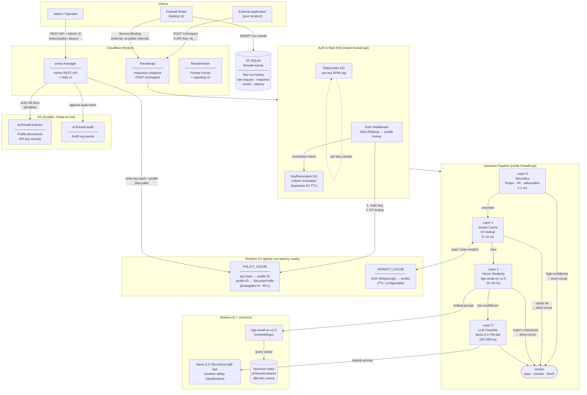

# Architecture — Cloudflare AI Firewall

## Component diagram



---

## Component roles

| Component | Type | Role |
|-----------|------|------|
| `firewall-api` | Worker | Latency-critical inspection endpoint. Runs the 4-layer detection pipeline for every prompt. |
| `policy-manager` | Worker | Admin control plane. Manages SecurityProfiles, API keys, audit log. Writes to KV + R2. |
| `firewall-tester` | Worker | Developer tool. Runs prompt sets against `firewall-api` via Service Binding, stores results in D1, serves reporting UI. |
| `POLICY_CACHE` | KV | Shared between both Workers. Stores SHA-256(key)→profileId pointer and full SecurityProfile documents. Globally replicated, ~60 s propagation. |
| `VERDICT_CACHE` | KV | Per-prompt verdict cache keyed by SHA-256(prompt). Short-circuits layers 2 and 3 on cache hit. |
| `ai-firewall-policies` | R2 | Durable storage for profile documents and API key records. Written by policy-manager; never read on the hot path. |
| `ai-firewall-audit` | R2 | Append-only audit log for all admin actions. |
| `firewall-events` | D1 | SQLite database owned by firewall-tester. Stores prompt, verdict, violations, latency, and raw request/response per test run. |
| `RateLimiter` | Durable Object | Per-key request counter. Enforces `rateLimit.requestsPerMinute` from the SecurityProfile. |
| `KeyRevocation` | Durable Object | Instant revocation store. Bypasses KV's ~60 s propagation delay — revoked keys are rejected immediately. |
| `bge-small-en-v1.5` | Workers AI | Embeds the incoming prompt into a 384-dim vector for similarity search (Layer 2). |
| `llama-3.3-70b-instruct-fp8-fast` | Workers AI | LLM safety classifier (Layer 3). Evaluates prompts against S1–S14 content safety categories. |
| `ai-firewall-attacks` (Vectorize) | Vectorize | 384-dim cosine index of known attack signatures. Layer 2 queries this with the prompt embedding. |
| Service Binding | Binding | Allows `firewall-tester` to call `firewall-api` directly over Cloudflare's internal network, bypassing the workers.dev public URL restriction. |

---

## Detection pipeline — short-circuit logic

```
prompt
  │
  ▼
Layer 0 — Heuristics (regex, PII patterns, base64/unicode obfuscation)
  ├─ high confidence  ──────────────────────────────► verdict  (≤1ms)
  └─ uncertain
       │
       ▼
Layer 1 — Verdict Cache  (KV lookup by SHA-256(prompt))
  ├─ cache hit  ─────────────────────────────────────► verdict  (5–10ms)
  └─ miss
       │
       ▼
Layer 2 — Vector Similarity  (embed → Vectorize cosine search)
  ├─ score ≥ threshold  ─────────────────────────────► verdict  (20–40ms)
  └─ low confidence
       │
       ▼
Layer 3 — LLM Classifier  (llama-3.3-70b content safety)
       └──────────────────────────────────────────────► verdict  (100–500ms)
```

Each layer only runs if the previous layer was inconclusive. The vast majority of obvious attacks exit at Layer 0 or Layer 1.

---

## Key data paths

### Hot path (every /v1/inspect request)
1. `firewall-api` auth middleware: SHA-256(key) → `POLICY_CACHE` KV read (x2) → SecurityProfile
2. `RateLimiter` DO: increment + check counter
3. `KeyRevocation` DO: check revoked flag
4. Layer 0–3 pipeline (short-circuits as early as possible)
5. On Layer 1 miss + final verdict: write verdict back to `VERDICT_CACHE`

### Admin path (policy-manager changes)
1. Validate + persist profile/key to `ai-firewall-policies` R2
2. Write fast-read copies to `POLICY_CACHE` KV (propagates globally in ~60 s)
3. Append structured event to `ai-firewall-audit` R2

### Test path (firewall-tester)
1. Browser → `firewall-tester` Worker → Service Binding → `firewall-api`
2. `firewall-tester` inserts result row into `D1 firewall-events`
3. Stats dashboard reads aggregates from D1 (`GROUP BY prompt_set, verdict`)
